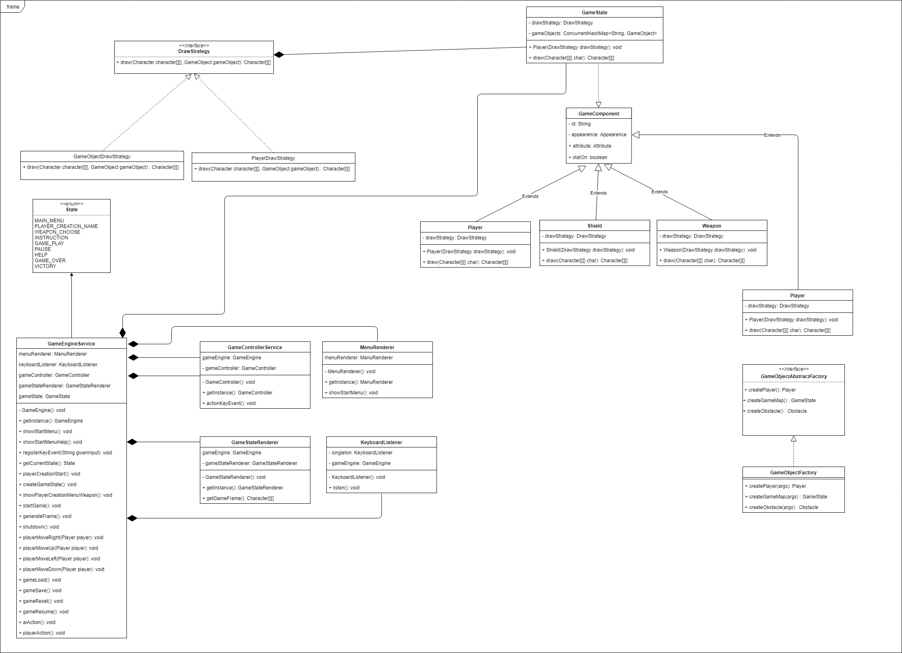
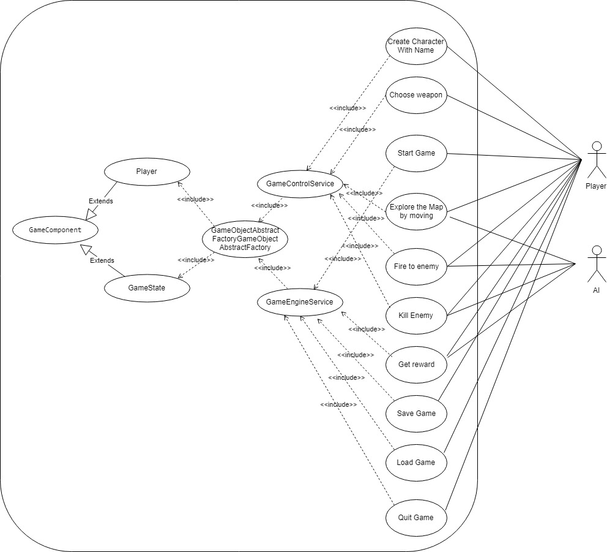
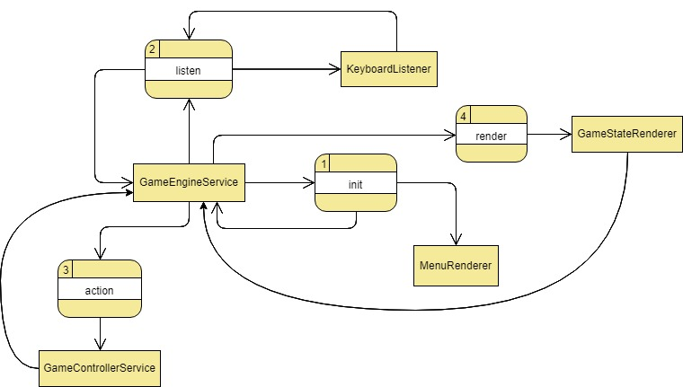
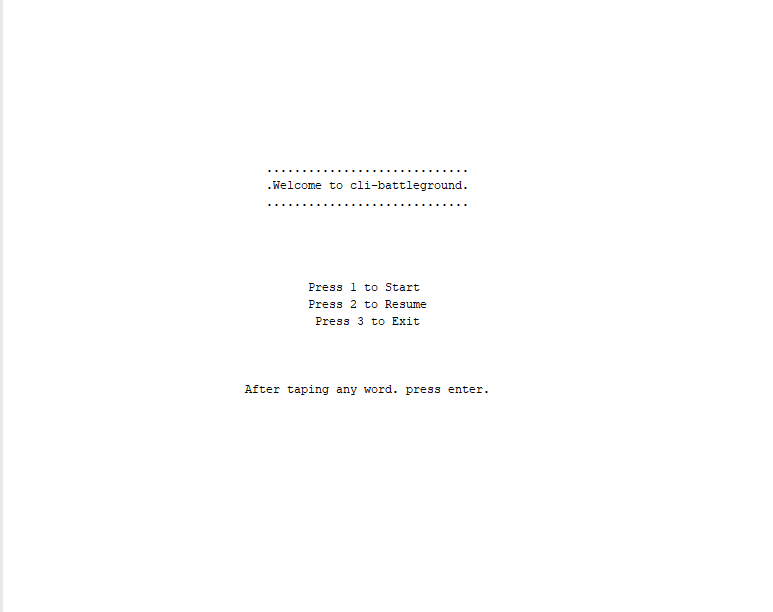
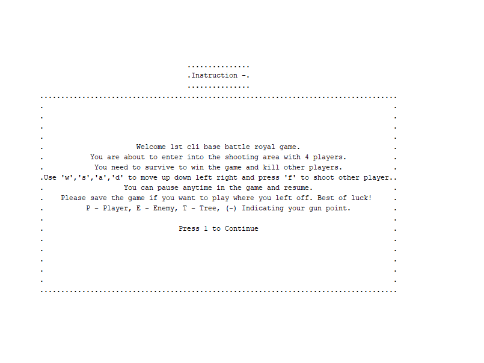
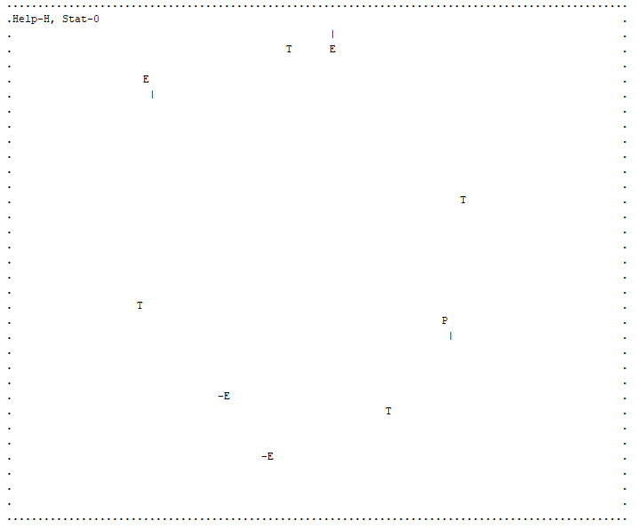
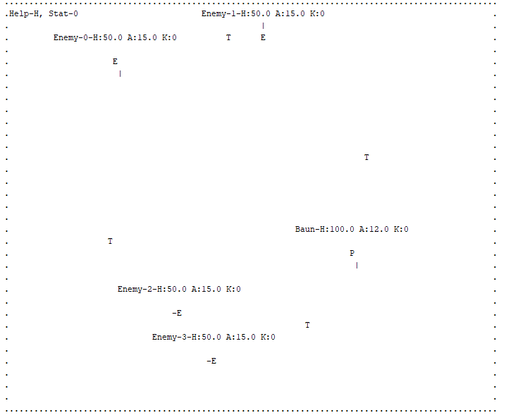

# Command Line Battleground (cli-bg)

## Objective 
* Need to create a command line role based game with Java
* Create a character and explore
* Without using any library for runtime
* Gain experience through fighting
* Save and resume a game
* Industry agile engineering practices

## Planning and analysis

* Requirement analysis and business understanding 
* Story building and activity listing 
* TDD planning

## Design
* Component design
* Game engine service flow
* Render service

## Coding Design

* Including the map the objects in the map are extended from the GameObject, and the map is programmed honoring **composite pattern** so that drawing game frame has become easier.
* As different object might have different drawing behaviour so we introduced strategy pattern to support different drawing algorithms to access the objects.
* To create GameObject **abstract factory pattern** is being used.
* The core engine of this game, as well as menu and frame drawing class is following **singleton pattern**.
* As we have plan to extend is game with multilayer feature so we kinda try to implement **observer pattern** to listen any key event.

## UML

### Class Diagram


### Use-case Diagram 


### Dataflow Diagram 


GameEngineService initiate (process: 1) the game. At the same time MenuRender generates the main frame and shows welcome menu. After that the event listener (process 2) starts listening to the events.

Whenever a keyboard event is triggered (like start game, load game, player movement) an action (process 2) is dispatched and controls goes to the game engine through GameControllerService. Then the game engine renders (process 4) the game state through GameStateRenderer and goes back to game engine service. Afterwards, the keyboard listener is again triggered and the process goes on like this.


## Scopes

* This application has scopes to create any type of game object whether it's visible on the map or not.
* Any kind of game story or map can be created without changing the core of this game.
* We can create custom character, behaviour, action or even movement.

## Requirement

- [x] Need to have [JDK 8](https://docs.oracle.com/javase/8/docs/technotes/guides/install/install_overview.html) installed and available to $PATH
- [x] You need to have [Maven 3](http://maven.apache.org/install.html) installed and available to $PATH


## Instruction to build
 
Project is based on Maven and can be built using the following command

*Clean Before Build:*
```
mvn clean
``` 
*Test Run:*
```
mvn test
``` 
*Package creation:*
```
mvn package
``` 

It will execute all the unit test script and validate the build. The build package will be available to **target** folder. 

## Instruction to run
 
### IDE

Run the program with `main` method from `org.ni.rpg.Main` class

### Command-line
```
java -jar target/cli-bg-1.0-SNAPSHOT.jar
```
If you are already in **target** folder then just 
```
java -jar cli-bg-1.0-SNAPSHOT.jar
```

## Constrain 
* While fighting, area of the opponent is not honored.
* GameObject overlapping is honored if GameObjects are not go through-able.
* Drawing Frame side by side is not supported.
* Character coloring is not supported currently.

## PS
This game is completely command-line based. You will face several AI player, it's sort of a battle royal game so the rule is simple **"Sweet victory is only for the last man surviving"**.

Checkout some screenshots -

* Introduction


* Instruction


* Game Play


* Game Statistics


Good luck :+1: